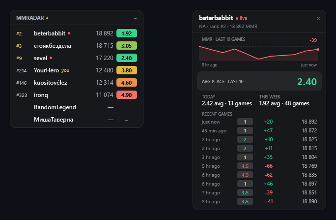

# MMRadar

A [Hearthstone Deck Tracker](https://hsreplay.net/downloads/) plugin for **Battlegrounds** that puts your whole lobby on the radar: it shows the leaderboard rating and average placement of every player at the table, and one click opens a full dossier on any of them — recent games, MMR trajectory, and current form, powered by [wallii.gg](https://www.wallii.gg/).



## Features

- 🏆 **Lobby overview** — all 8 players with their leaderboard rank, rating, and average placement, sorted by rating. Players who are streaming get a live dot; dead players grey out as the game goes on.
- 🔍 **Player dossier on click** — recent games (estimated placement, MMR delta, resulting MMR), average placement over the last ~10 games / today / this week, and an MMR trajectory chart aligned with the game list.
- 🎨 **Three themes** — **Dark** (solid, maximum readability — default), **Glass** (translucent and airy), **Warm** (blends with Hearthstone's look). Switch instantly in Settings.
- 🫥 **Stays out of your way** — collapse the panel into a tiny ~30%-opacity pill; click the pill to expand, drag to move. Position, scale, and collapsed state persist.
- 🧪 **Live preview** — show the overlay with the current world top-8 (real wallii data) to position and scale it without starting a game.

## Install

1. Download `MMRadar.dll` from [Releases](../../releases) (or build it — see below) and drop it into:
   `%AppData%\HearthstoneDeckTracker\Plugins`
2. Restart Hearthstone Deck Tracker.
3. Enable the plugin: **Options → Tracker → Plugins → MMRadar**.

Requirements: Windows, Hearthstone Deck Tracker (the plugin resolves its assemblies from the HDT install), .NET Framework 4.7.2 (ships with HDT).

> If Windows blocks the downloaded DLL, right-click it → Properties → check **Unblock**.

## Usage

- The panel appears automatically at the start of a Battlegrounds match, as soon as the game reports the lobby roster.
- **Click a player row** to open their recent-games popup. Click another row to switch, or ✕ to close it.
- **Plugins → MMRadar** in the HDT menu is a plain on/off checkbox, like other plugins.
- The **Settings** button (Options → Tracker → Plugins → MMRadar) opens a small dialog: theme picker, live top-8 preview toggle, and position/scale reset.
- **–** collapses the panel into a small semi-transparent pill; clicking the pill expands it back, dragging moves it. The mouse wheel over the header zooms the whole overlay.

## How it works

- **Lobby names** come from HDT's own memory mirror (`BattlegroundsLobbyInfo` via HearthMirror), with a Power.log fallback (`PlayerID=…, PlayerName=…` lines). No portrait-hovering or extra memory-reading DLLs are needed.
- **Stats** come from wallii.gg's public Supabase REST API — the same backend their website queries from the browser. wallii mirrors the official Blizzard Battlegrounds leaderboards every few minutes, which implies two honest limitations:
  - only players **above the leaderboard cutoff** (roughly 8000+ MMR) can be resolved; everyone else shows as "—";
  - per-game **placements are estimates** inferred from MMR changes (wallii's published formula), not exact Blizzard data.
- Requests are batched (2–3 per lobby) and cached for 5 minutes to keep the load on wallii minimal. The plugin never scrapes the wallii website itself.

If wallii ever rotates their public API key, override it in
`%AppData%\HearthstoneDeckTracker\MMRadar\settings.xml` (`WalliiBaseUrl`, `WalliiAnonKey`).

## Building from source

Prerequisites: [.NET SDK](https://dotnet.microsoft.com/download) 6+ and an installed Hearthstone Deck Tracker.

```powershell
tools\build.ps1     # auto-detects your HDT install for assembly references
# or explicitly:
dotnet build MMRadar.sln -c Release -p:HdtDir="$env:LOCALAPPDATA\HearthstoneDeckTracker\app-<version>"

tools\deploy.ps1    # build + copy the DLL into HDT's Plugins folder
```

`src/MMRadar.Harness` is a standalone WPF test bed that renders the overlay without HDT or Hearthstone:

```powershell
MMRadar.Harness.exe                                   # sample lobby
MMRadar.Harness.exe --top                             # live world top-8
MMRadar.Harness.exe --live name1,name2 --region EU    # specific players
MMRadar.Harness.exe --theme glass --shot out.png      # screenshot a theme
```

## Credits

- **[wallii.gg](https://www.wallii.gg/)** by JimLiu0 & the Wall_Lii team ([wall-lii-app](https://github.com/JimLiu0/wall-lii-app), [Wall_Lii](https://github.com/HS-Tools/Wall_Lii)) — leaderboard data and the placement-estimation formula this plugin re-implements. MMRadar is an unofficial community project and is not affiliated with wallii.
- **[HDT_BGrank](https://github.com/IBM5100o/HDT_BGrank)** by IBM5100 — the original "opponent MMR overlay" idea.
- **[Hearthstone Deck Tracker](https://github.com/HearthSim/Hearthstone-Deck-Tracker)** by HearthSim.

Not affiliated with Blizzard Entertainment. Hearthstone is a trademark of Blizzard Entertainment, Inc.

## License

[MIT](LICENSE)
